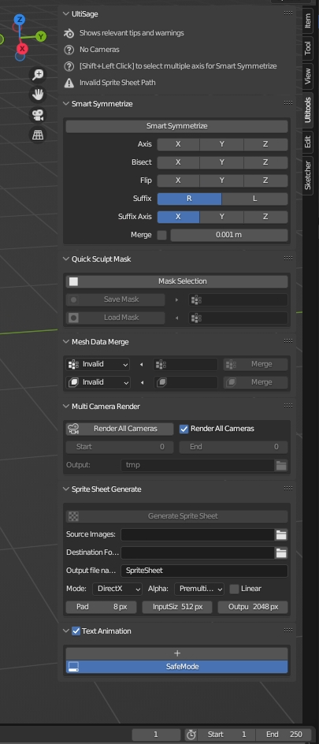
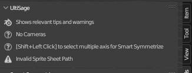

# UltiTools 🛠️

UltiTools is a powerful Blender add-on that enhances Blender's capabilities by providing various tools for modeling and asset creation. With UltiTools, you can expand Blender's functionality and improve your workflow. This documentation provides an overview of UltiTools and its features.

## Installation 🚀

To install UltiTools, follow the steps below:

1. Download the add-on ZIP file from the [Blender Market](https://blendermarket.com/products/ultitools) ⬇️
2. Launch Blender and navigate to **Edit > Preferences** 
3. In the Preferences window, select the **Add-ons** tab 
4. Click the **Install** button 
5. Locate and select the downloaded ZIP file 
6. Click the **Install Add-on** button 
7. Enable the add-on by ticking the checkbox next to its name 
8. Configure any additional settings if required 
9. Click the **Save Preferences** button 

UltiTools is now installed and ready to use. 🎉

## Usage 🧑‍💻

Once UltiTools is installed and enabled, you can access its features within Blender. For more additional information about each feature, refer to tooltips within Blender.

Here are some basic instructions for using the add-on:
1. Launch Blender and open your desired project 
2. Locate the UltiTools panel or menu in Blender's UI (found in the sidebar) 
3. Click on the add-on's options to activate specific features 
4. Adjust any parameters or settings as needed 
5. Interact with the objects or elements in your scene to apply UltiTools' functionality 

## Features ✨

UltiTools offers the following key features:

### Ulti Sage 🧙
Ulti Sage is the first tab you will see when you open UltiTools. It will show you relevant information according to what is selected and depending on what exists in the scene. 

### Smart Symmetrize 🔄
Perform actions that go beyond the capabilities of the Mirror Modifier. Mirror Shape Keys and bisect the mesh without mirroring the mesh itself.

### Mesh Data Merge 🧩
Easily combine Shape Keys or Vertex Groups.

### Quick Sculpt Mask 🎭
Save and load Sculpt masks using Vertex Groups, allowing for the application of selection as masks.

### Text Animation
📝🎬
Bring your Text Objects to life using keyframes and Python scripting.

### Sprite Sheet Gen 🎞️
Generate sprite sheets directly within Blender.

### Multi Camera Render 🎥🎥🎥
Render multiple cameras using unique frame ranges and output paths for each camera.

### Bonus Blend file 🎁
Includes a showcase of how Text Animation works. Same file as used in the video showcase.

## FAQ ❓
Here are some frequently asked questions about UltiTools

**Q:** How can I update UltiTools to a newer version? 

**A:** To update the add-on, download the latest version from the official website and follow the installation steps mentioned in the
[Installation](#Installation-🚀) section. 

## License 

UltiTools is licensed under the **Single User License**. This license grants you the following rights:

1. **Usage**: You are authorized to use UltiTools on a single device or computer. 

2. **Modifications**: You can modify UltiTools to suit your specific needs or preferences. 

3. **Personal Use**: You can use UltiTools for both non-commercial and commercial purposes. 

However, the Single User License imposes the following restrictions:

1. **Distribution**: You are not permitted to distribute or share UltiTools with others. 

## Conclusion 🎉

Thank you for choosing UltiTools as your go-to Blender add-on. We hope that this documentation has provided you with a comprehensive understanding of UltiTools and its features. Remember to abide by the Single User License terms and conditions while utilizing the add-on. If you have any further questions or feedback, please feel free to contact me directly at Hussein.Ubeid@outlook.com. 📧

## Changelog 📋

### Version 0.4.0
- UI elements are now separated for each tool.
- Text animation overhauled 
- Improved performance and optimized resource usage. 
- Updated dependencies to the latest versions. 

🚀 Happy Blendering with UltiTools! 🎨🖌️